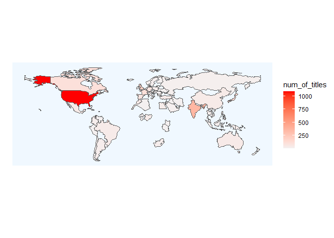
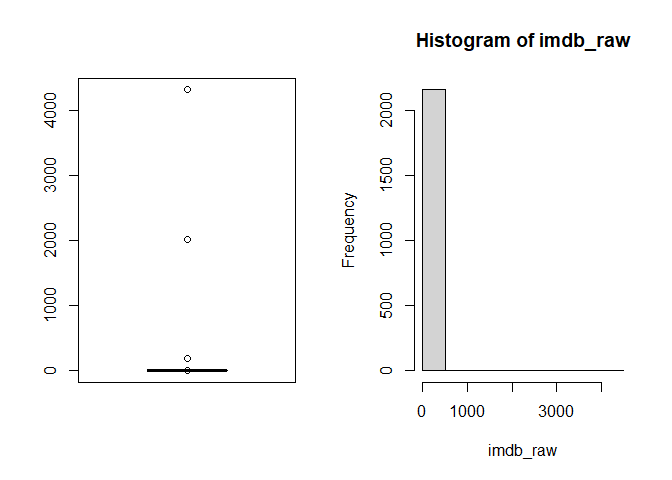
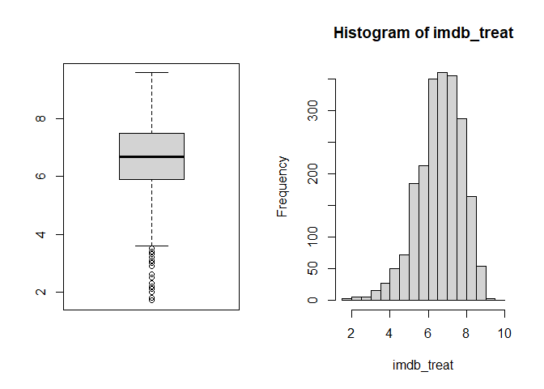
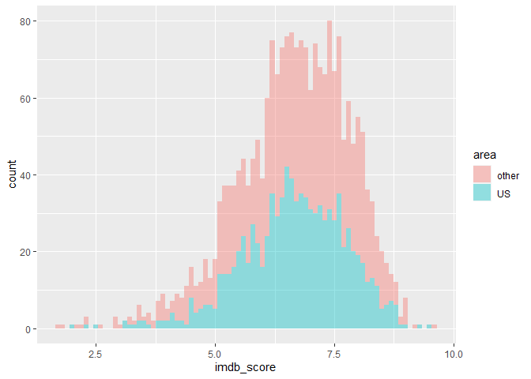
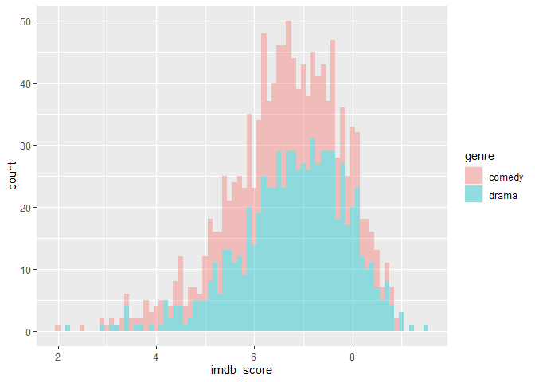
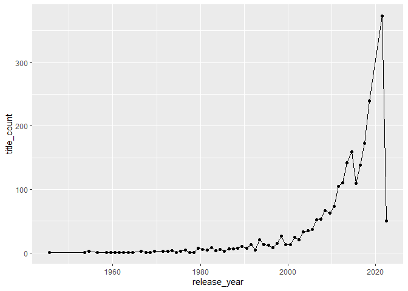
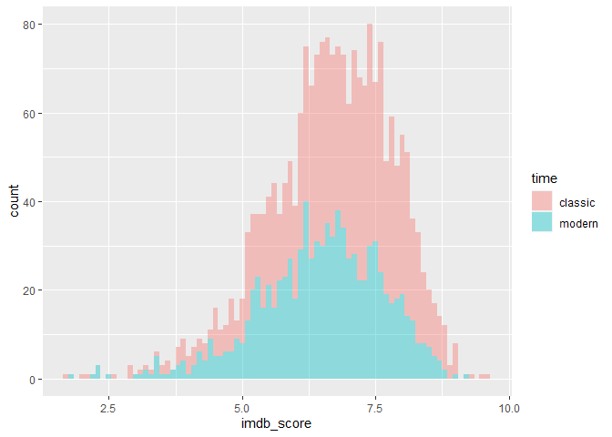

# Netflix-Analysis

EDA and data mining are used to deeply wrangle data. 

## Exploratory Data Analysis and statistical test for Netflix data

This is an exploratory analysis and statistical approach to Netflix
data. Data are available
[here](https://www.kaggle.com/datasets/victorsoeiro/netflix-tv-shows-and-movies?select=titles.csv)

We have two datasets which are connected with “id” key.

``` r
credit <- read.csv("../input/credits.csv")
titles <- read.csv("../input/titles.csv")
head(credit)
```

    ##   person_id      id            name               character  role
    ## 1      3748 tm84618  Robert De Niro           Travis Bickle ACTOR
    ## 2     14658 tm84618    Jodie Foster           Iris Steensma ACTOR
    ## 3      7064 tm84618   Albert Brooks                     Tom ACTOR
    ## 4      3739 tm84618   Harvey Keitel Matthew 'Sport' Higgins ACTOR
    ## 5     48933 tm84618 Cybill Shepherd                   Betsy ACTOR
    ## 6     32267 tm84618     Peter Boyle                  Wizard ACTOR

``` r
head(titles)
```

    ##         id                               title  type
    ## 1 ts300399 Five Came Back: The Reference Films  SHOW
    ## 2  tm84618                         Taxi Driver MOVIE
    ## 3 tm127384     Monty Python and the Holy Grail MOVIE
    ## 4  tm70993                       Life of Brian MOVIE
    ## 5 tm190788                        The Exorcist MOVIE
    ## 6  ts22164        Monty Python's Flying Circus  SHOW
    ##                                                                                                                                                                                                                                                                                                                                                                                                                                                          description
    ## 1                                                                                                                                                                                                                                                                                                  This collection includes 12 World War II-era propaganda films 窶\x94 many of which are graphic and offensive 窶\x94 discussed in the docuseries "Five Came Back."
    ## 2                                                                                                                                                                                                                                A mentally unstable Vietnam War veteran works as a night-time taxi driver in New York City where the perceived decadence and sleaze feed his urge for violent action, attempting to save a preadolescent prostitute in the process.
    ## 3                                    King Arthur, accompanied by his squire, recruits his Knights of the Round Table, including Sir Bedevere the Wise, Sir Lancelot the Brave, Sir Robin the Not-Quite-So-Brave-As-Sir-Lancelot and Sir Galahad the Pure. On the way, Arthur battles the Black Knight who, despite having had all his limbs chopped off, insists he can still fight. They reach Camelot, but Arthur decides not  to enter, as "it is a silly place".
    ## 4 Brian Cohen is an average young Jewish man, but through a series of ridiculous events, he gains a reputation as the Messiah. When he's not dodging his followers or being scolded by his shrill mother, the hapless Brian has to contend with the pompous Pontius Pilate and acronym-obsessed members of a separatist movement. Rife with Monty Python's signature absurdity, the tale finds Brian's life paralleling Biblical lore, albeit with many more laughs.
    ## 5                                                                                                                12-year-old Regan MacNeil begins to adapt an explicit new personality as strange events befall the local area of Georgetown. Her mother becomes torn between science and superstition in a desperate bid to save her daughter, and ultimately turns to her last hope: Father Damien Karras, a troubled priest who is struggling with his own faith.
    ## 6                                                                                                                                                                                                                                                                                            A British sketch comedy series with the shows being composed of surreality, risquﾃｩ or innuendo-laden humour, sight gags and observational sketches without punchlines.
    ##   release_year age_certification runtime                 genres
    ## 1         1945             TV-MA      48      ['documentation']
    ## 2         1976                 R     113     ['crime', 'drama']
    ## 3         1975                PG      91  ['comedy', 'fantasy']
    ## 4         1979                 R      94             ['comedy']
    ## 5         1973                 R     133             ['horror']
    ## 6         1969             TV-14      30 ['comedy', 'european']
    ##   production_countries seasons   imdb_id imdb_score imdb_votes tmdb_popularity
    ## 1               ['US']     1.0                                             0.6
    ## 2               ['US']         tt0075314        8.3   795222.0          27.612
    ## 3               ['GB']         tt0071853        8.2   530877.0          18.216
    ## 4               ['GB']         tt0079470        8.0   392419.0          17.505
    ## 5               ['US']         tt0070047        8.1   391942.0          95.337
    ## 6               ['GB']     4.0 tt0063929        8.8    72895.0          12.919
    ##   tmdb_score
    ## 1           
    ## 2        8.2
    ## 3        7.8
    ## 4        7.8
    ## 5        7.7
    ## 6        8.3

``` r
t1 <- credit %>% filter(role %in% c("ACTOR","DIRECTOR"))
t2 <- titles %>% filter(type %in% c("SHOW","MOVIE"))
table(t1$role)
```

    ## 
    ##    ACTOR DIRECTOR 
    ##    72435     4517

``` r
table(t2$type)
```

    ## 
    ## MOVIE  SHOW 
    ##  1531   771

Credit data has information of their role (ACTOR or DIRECTOR). Titles
data has title type (MOVIE or TVSHOW).

### Exploratory Data Analysis

Take a look at data worldwide.

``` r
country_list <- str_extract_all(titles$production_countries,"[A-Z]+")
n_country <- data.frame(id=titles$id,num_countries=map_dbl(country_list,~length(.)))
country_names <- countrycode(unlist(country_list),origin = "genc2c", destination = "country.name")
df_country <- data.frame(name=unlist(country_names)) %>% filter(is.na(name)==F) %>% 
  group_by(name) %>% summarise(num_of_titles=n()) %>% arrange(desc(num_of_titles))
head(df_country,10)
```

    ## # A tibble: 10 x 2
    ##    name           num_of_titles
    ##    <chr>                  <int>
    ##  1 United States           1084
    ##  2 India                    349
    ##  3 United Kingdom           189
    ##  4 Japan                    149
    ##  5 France                   102
    ##  6 Canada                    99
    ##  7 South Korea               76
    ##  8 Spain                     70
    ##  9 Germany                   62
    ## 10 Tuvalu                    59

In terms of production country, united states is by far the most. Put it
onto the map, it will be as below.

``` r
world <- ne_countries(returnclass = "sf") %>% merge(df_country,ny="name")
map <- ggplot(data = world) + geom_sf(aes(fill = num_of_titles)) + theme_classic() + 
  coord_sf(datum = NA) + xlab("") + ylab("") + 
  theme(panel.grid.major = element_line(color = grey(0.5), linetype = "dashed", 
                                        size = 0.5), panel.background = element_rect(fill = "aliceblue"), legend.background = element_rect(fill="transparent")) +
  scale_fill_gradient(low = "#f4f0f0", high = "red", na.value="white")
map
```

<!-- -->

Then, let’s move on to credit data.

``` r
stakeholders_used <- credit %>% group_by(id) %>% summarise(stakeholders=n_distinct(person_id))
stakeholders_count <- credit %>% group_by(person_id,name) %>% summarise(count=n()) %>% arrange(desc(count))
head(stakeholders_count,10)
```

    ## # A tibble: 10 x 3
    ## # Groups:   person_id [10]
    ##    person_id name                  count
    ##        <int> <chr>                 <int>
    ##  1     38632 Shah Rukh Khan           30
    ##  2      1345 Anupam Kher              25
    ##  3     38636 Boman Irani              25
    ##  4     48004 Kareena Kapoor Khan      25
    ##  5       138 Takahiro Sakurai         22
    ##  6     69034 Paresh Rawal             22
    ##  7     12022 Priyanka Chopra Jonas    21
    ##  8     26948 Nawazuddin Siddiqui      21
    ##  9    211560 Raﾃｺl Campos             21
    ## 10    590250 Jan Suter                20

Their name look indian? 5th man Mr. Sakurai is a Japanese voice actor.

Next, we are interested in which genre is popular among netflix titles.
Dive into it with a wordcloud.

``` r
genre_list <- str_extract_all(titles$genres,"[a-z]+")
n_genre <- data.frame(id=titles$id,num_genres=map_dbl(genre_list,~length(.)))
df_genre <- data.frame(genre=unlist(genre_list)) %>% 
  group_by(genre) %>% summarise(count=n()) %>% arrange(desc(count))
my_graph <- wordcloud2(df_genre, size = 2)
saveWidget(my_graph, "tmp.html", selfcontained = F)
webshot("tmp.html", "wc1.png", delay = 5, vwidth = 2000, vheight = 2000)
```

<!-- -->

Drama and comedy are the most popular. It might be better for action,
scifi to be watched in the theater with IMAX screens

We have IMDB score as well. Is netflix reviewer critical? Are they
likely to give good score?

``` r
imdb_raw <- titles$imdb_score %>% as.numeric()
par(mfcol=c(1,2))
boxplot(imdb_raw)
hist(imdb_raw)
```

<!-- -->

IMDB score should be lower or equal to 10. Just treat overrated titles
as outliers.

``` r
par(mfcol=c(1,2))
imdb_treat <- titles[as.numeric(titles$imdb_score)<=10,]$imdb_score %>% as.numeric()
boxplot(imdb_treat)
hist(imdb_treat)
```

<!-- -->

``` r
summary(imdb_treat)
```

    ##    Min. 1st Qu.  Median    Mean 3rd Qu.    Max.    NA's 
    ##   1.700   5.900   6.700   6.654   7.500   9.600     941

IMDB scores are fairly high with 6.7 points on average! Netflix contains
popular and highly rated titles!

### Statistical test

Now we get that these movies have great score overall. But, can scores
be different from some perspectives such as genre, production country.
Let’s check these questions. We are going to use Welch’s t-test with 5%
significance level.

#### 1. United states vs Others

Obviously, many titles are created in the US. Compare titles whose
production countries includes US or not.

``` r
us_title <- titles %>% mutate(imdb_score=as.numeric(imdb_score)) %>% 
  filter(grepl(pattern = "US", x=production_countries) & imdb_score<=10) %>% mutate(area="US")
non_us_title <- titles %>% mutate(imdb_score=as.numeric(imdb_score)) %>% 
  filter(!grepl(pattern = "US", x=production_countries) & imdb_score<=10) %>% mutate(area="other")
df <- rbind(us_title[,c("id","imdb_score","area")],non_us_title[,c("id","imdb_score","area")])
g <- ggplot(df) + geom_histogram(aes(imdb_score,fill=area),alpha=.4,binwidth = .1)
g
```

<!-- -->

It seems that there is not significant difference in distribution.
Execute t-test with null hypothesis; US production score is equal to
other countries score.

``` r
res <- t.test(us_title$imdb_score,non_us_title$imdb_score)
print(res)
```

    ## 
    ##  Welch Two Sample t-test
    ## 
    ## data:  us_title$imdb_score and non_us_title$imdb_score
    ## t = -0.0045834, df = 2102.4, p-value = 0.9963
    ## alternative hypothesis: true difference in means is not equal to 0
    ## 95 percent confidence interval:
    ##  -0.09851865  0.09805921
    ## sample estimates:
    ## mean of x mean of y 
    ##  6.653541  6.653770

Null hypothesis was not rejected. There is no significant difference.

#### 2. Comedy vs Drama

Comedy and drama could be seen as a popular genre in Netflix. Check IMDB
score distributions of each genre. Here, we exclude titles which have
both comedy and drama as its genre.

``` r
titles_no_dup <- titles %>% mutate(imdb_score=as.numeric(imdb_score)) %>% 
  filter(!grepl(pattern = "comedy", x=genres)|!grepl(pattern = "drama", x=genres)) %>% 
  filter(imdb_score<=10)
comedy <- filter(titles_no_dup, grepl(pattern = "comedy", x=genres)) %>% mutate(genre="comedy")
drama <- filter(titles_no_dup, grepl(pattern = "drama", x=genres)) %>% mutate(genre="drama")
df <- rbind(comedy[,c("id","imdb_score","genre")],drama[,c("id","imdb_score","genre")])
g <- ggplot(df) + geom_histogram(aes(imdb_score,fill=genre),alpha=.4,binwidth = .1)
g
```

<!-- -->

Drama seems to be higher?? Execute t-test with null hypothesis; comedy
score is equal to drama score.

``` r
res <- t.test(comedy$imdb_score,drama$imdb_score)
print(res)
```

    ## 
    ##  Welch Two Sample t-test
    ## 
    ## data:  comedy$imdb_score and drama$imdb_score
    ## t = -5.3569, df = 993.18, p-value = 1.052e-07
    ## alternative hypothesis: true difference in means is not equal to 0
    ## 95 percent confidence interval:
    ##  -0.4923698 -0.2283529
    ## sample estimates:
    ## mean of x mean of y 
    ##  6.446943  6.807304

Null hypothesis was rejected.p-value is less than 0.05 and there is
significant difference between comedy and drama. Comedy titles seems to
get higher score than drama.

#### 3. Classic vs Modern

We have not touched time series things. Let’s check historical
statistics of Netflix data.

``` r
titles_year <- titles %>% filter(grepl("^\\d{4}$",titles$release_year)) %>%
  mutate(release_year=as.Date(as.character(release_year), format = "%Y"))
titles_year %>% group_by(release_year) %>% summarise(title_count=n()) %>%
  ggplot(aes(release_year,title_count)) + geom_line() + geom_point()
```

<!-- -->

The number of titles has been increasing considerably since around 2015.
Let’s say titles released before 2015 as “classic”, others as “modern”.
Check thei IMDB score distributions.

``` r
titles_year <- titles %>% mutate(imdb_score=as.numeric(imdb_score)) %>% 
  filter(grepl("^\\d{4}$",titles$release_year)) %>%
  mutate(release_year=as.Date(as.character(release_year), format = "%Y")) %>% 
  filter(imdb_score<=10)
classic <- filter(titles_year, release_year<="2015-12-31") %>% mutate(time="classic")
modern <- filter(titles_year, release_year>="2016-01-01") %>% mutate(time="modern")
df <- rbind(classic[,c("id","imdb_score","time")],modern[,c("id","imdb_score","time")])
g <- ggplot(df) + geom_histogram(aes(imdb_score,fill=time),alpha=.4,binwidth = .1)
g
```

<!-- -->

Classic seems to be higher?? Execute t-test with null hypothesis;
classic score is equal to modern score.

``` r
res <- t.test(classic$imdb_score,modern$imdb_score)
print(res)
```

    ## 
    ##  Welch Two Sample t-test
    ## 
    ## data:  classic$imdb_score and modern$imdb_score
    ## t = 6.1075, df = 1948.8, p-value = 1.218e-09
    ## alternative hypothesis: true difference in means is not equal to 0
    ## 95 percent confidence interval:
    ##  0.2100679 0.4087884
    ## sample estimates:
    ## mean of x mean of y 
    ##  6.783654  6.474226

Null hypothesis was rejected.P-value is less than 0.05 and there is
significant difference between classic and modern. Classic titles seems
to get higher score than modern.

## Conclusion

Although we got results that there are significant difference between
drama and comedy, classic and modern. But these differences were just
little.They are facts but we should keep an eye on other numbers such as
confidential intervals, population sizes, their distribution itself and
so on. Facts are just a tool for decision making.
